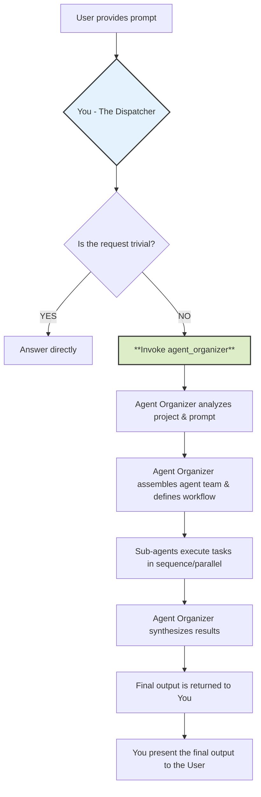
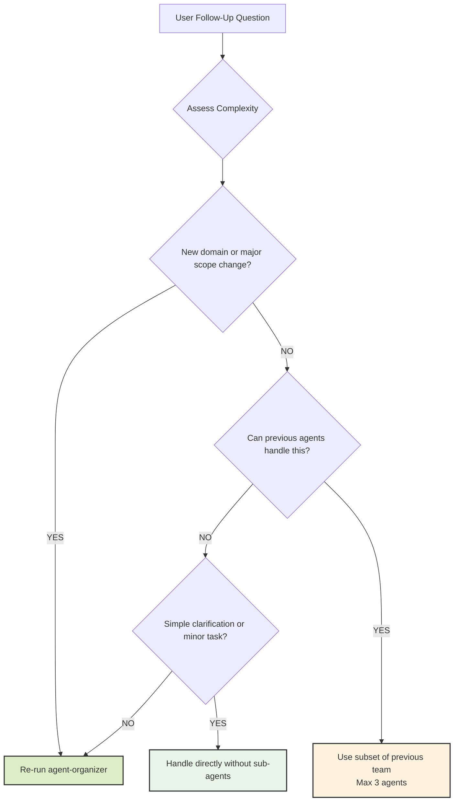

# CLAUDE.md

This file provides guidance to Claude Code (claude.ai/code) when working with code in this repository.

## Project Overview

**CantoCap Desktop GUI** is a modern Electron-based desktop application for generating Cantonese subtitles from audio/video files. It provides an intuitive graphical interface for the CantoCap Python engine, featuring advanced AI-powered transcription with optional Gemini API integration, speaker identification, music detection, and comprehensive subtitle editing capabilities.

### Key Features

- 🎬 **Drag & Drop Interface** - Easy file selection with preview
- 🔧 **Advanced Configuration** - Comprehensive settings for transcription optimization
- ⚡ **Real-time Progress** - Live progress tracking with hardware monitoring
- 🧠 **AI-Powered** - Optional Gemini API integration for enhanced accuracy
- 🌐 **Multi-language** - Support for Traditional and Simplified Chinese output
- 🎯 **Speaker Identification** - Automatic speaker diarization
- 🎵 **Music Detection** - Identify and label music segments
- 📝 **Subtitle Editor** - Built-in editor with real-time preview
- 📱 **Cross-platform** - Windows, macOS, and Linux support

## Technology Stack

### Core Technologies

- **Runtime**: Node.js 18+, Electron 37.2.4
- **Package Manager**: pnpm 8.15.0+ (required - do not use npm/yarn)
- **Build System**: Electron Vite 4.0.0 with Vite 7.0.6
- **Language**: TypeScript 5.8.3

### Frontend Stack

- **Framework**: React 19.1.1 with TypeScript
- **UI Library**: Material-UI (MUI) 7.2.0 with Emotion styling
- **State Management**: Zustand 5.0.6
- **Styling**: TailwindCSS 4.1.11 with PostCSS
- **Component Architecture**: Modular component system with step-based workflow

### Engine Integration

- **IPC Communication**: Secure Electron IPC with context isolation
- **Python Engine**: External CantoCap engine communication via process management
- **File Operations**: Native Electron file system APIs
- **System Integration**: Dependency checking, hardware monitoring

## Development Commands

### Quick Start

```bash
# Install Dependencies (MUST use pnpm)
pnpm install

# Start Development Server (with hot reload)
pnpm dev

# Start Preview Mode
pnpm preview
```

### Building & Distribution

```bash
# Build Application
pnpm build

# Type Check (run before committing)
pnpm type-check

# Lint Code (run before committing)
pnpm lint

# Fix linting issues automatically
pnpm lint:fix

# Package Application (without installer)
pnpm package

# Create Distribution (with installer)
pnpm dist

# Platform-specific Distribution
pnpm dist:win    # Windows
pnpm dist:mac    # macOS  
pnpm dist:linux  # Linux
```

### Testing

```bash
# Run Tests
pnpm test

# Run Tests with Coverage
pnpm test:coverage

# Watch Mode for Testing
pnpm test:watch
```

### Code Quality

```bash
# Format Code
pnpm format

# Check Formatting
pnpm format:check

# Performance Linting
pnpm lint:performance
```

## Architecture Overview

### Multi-Process Electron Architecture

The application follows a **multi-process Electron architecture**:

- **Main Process** (`src/main/`): System integration, file operations, Python engine communication
- **Renderer Process** (`src/renderer/`): React UI with secure IPC communication
- **Preload Script** (`src/preload/`): Secure bridge between main and renderer processes
- **Engine Integration**: Communication with the CantoCap Python engine via IPC

### Key Architectural Components

#### Main Process (`src/main/index.ts`)
- **CantoCap Class**: Main application orchestrator
- **DependencyChecker**: Validates system requirements (Python 3.12, FFmpeg)
- **ProcessManager**: Manages Python engine subprocess communication
- **InitializationService**: Handles app startup and dependency setup
- **IPC Handlers**: Secure communication channels with renderer

#### State Management (`src/renderer/src/stores/`)
The app uses **Zustand** for state management with separate stores:
- **useAppStore**: Global application state and configuration
- **useWorkspaceStore**: Workspace and project management
- **useWorkflowStore**: Step-based workflow state
- **useStepStore**: Individual step configurations
- **useSubtitleEditStore**: Subtitle editing state

#### Component Architecture
- **Step-based Workflow**: InputFile → Config → Processing → Review → Export
- **Modular Components**: Each major feature is a self-contained component tree
- **Error Boundaries**: Comprehensive error handling at component level
- **Material-UI Integration**: Consistent design system with custom theming

#### IPC Architecture
- **Context Isolation**: Secure communication via `contextBridge`
- **Type Safety**: Full TypeScript interfaces for all IPC messages
- **Event Handling**: Modern `ipc-message` system
- **Process Communication**: Real-time updates during subtitle generation

### File Structure

```
src/
├── main/                    # Electron main process
│   ├── config/             # Configuration services
│   ├── index.ts            # Main application entry
│   ├── dependency-checker.ts
│   ├── process-manager.ts
│   └── initialization-service.ts
├── preload/                # IPC bridge
│   └── index.ts            # Context bridge API
├── renderer/src/           # React frontend
│   ├── components/         # React components
│   │   ├── steps/         # Workflow steps
│   │   ├── forms/         # Input forms
│   │   ├── layout/        # Layout components
│   │   └── common/        # Shared components
│   ├── stores/            # Zustand state stores
│   ├── services/          # Business logic
│   ├── types/             # TypeScript definitions
│   └── utils/             # Utility functions
└── types/                 # Shared type definitions
```

## Important Development Guidelines

### Path Resolution
The project uses TypeScript path mapping:
- `@/*` → `src/*`
- `@main/*` → `src/main/*`
- `@preload/*` → `src/preload/*`
- `@renderer/*` → `src/renderer/*`

### State Management Patterns
- Use Zustand stores for state management
- Store actions are exposed via custom hooks (e.g., `useAppActions()`)
- Avoid direct store mutation - use provided actions
- State persistence is handled automatically via electron-store

### IPC Communication
- All IPC calls are type-safe with TypeScript interfaces
- Use the modern `ipc-message` system for new features
- Always handle IPC errors gracefully

### Component Development
- Follow Material-UI design system
- Use proper TypeScript JSX types (`JSX.Element`)
- Implement error boundaries for major feature areas
- Keep components modular and testable

### Build Configuration
- **Electron Vite** handles the build pipeline
- **Main process**: CommonJS output with source maps
- **Preload scripts**: Force `.cjs` extension for compatibility  
- **Renderer**: Modern ESM with React Fast Refresh
- **Chunk splitting**: Vendor, MUI, and utils chunks for optimization

### Security Considerations
- Context isolation enabled with secure IPC
- Node.js globals removed from renderer process
- Input validation for all user data
- External URLs opened in system browser, not in-app

## External Dependencies

- **Python 3.12**: Required for the CantoCap engine
- **FFmpeg**: Required for audio/video processing
- **CantoCap Engine**: Located in `../engine/` directory
- The app includes dependency checking and guided installation

## Development Tips

### Hot Reload & Debugging
- Use `pnpm dev` for development with hot reload
- DevTools automatically open in development mode
- Main process logging via console, renderer via browser DevTools
- Global shortcuts: F12, Cmd/Ctrl+Shift+I for DevTools

### Testing Strategy
- Jest with jsdom for unit tests
- React Testing Library for component testing
- Test files co-located with components in `__tests__/` directories
- Integration tests for IPC communication

### Performance Considerations
- Build configuration optimized for development speed
- Chunk splitting reduces bundle size
- Source maps enabled for debugging
- Minification disabled in development for better debugging

### Common Gotchas
- Always use `pnpm` - other package managers may cause issues
- IPC calls must be properly typed for TypeScript compliance
- Electron security model requires context isolation
- Python engine communication is asynchronous - handle promises properly

# Full Stack Development Guidelines

## Philosophy

### Core Beliefs

- **Iterative delivery over massive releases** – Ship small, working slices of functionality from database to UI.
- **Understand before you code** – Explore both front-end and back-end patterns in the existing codebase.
- **Pragmatism over ideology** – Choose tools and architectures that serve the project’s goals, not personal preference.
- **Readable code over clever hacks** – Optimize for the next developer reading your code, not for ego.

### Simplicity Means

- One clear responsibility per module, class, or API endpoint.
- Avoid premature frameworks, libraries, or abstractions.
- While latest and new technology is considerable, stable and efficient should be prioritized.
- If your integration flow diagram needs an explanation longer than 3 sentences, it’s too complex.

---

## Process

### 1. Planning & Staging

Break work into 3–5 cross-stack stages (front-end, back-end, database, integration). Document in `IMPLEMENTATION_PLAN.md`:

```markdown
## Stage N: [Name]
**Goal**: [Specific deliverable across the stack]  
**Success Criteria**: [User story + passing tests]  
**Tests**: [Unit, integration, E2E coverage]  
**Status**: [Not Started|In Progress|Complete]
```

- Update status after each merge.
- Delete the plan file after all stages are verified in staging and production.

### 2. Implementation Flow

- **Understand** – Identify existing patterns for UI, API, DB, and CI/CD.
- **Test First** – For back-end, write API integration tests; for front-end, write component/unit tests.
- **Implement Minimal** – Just enough code to pass all tests.
- **Refactor Safely** – Clean code with test coverage at 60%+ for changed areas.
- **Commit Clearly** – Reference plan stage, include scope (front-end, back-end, DB).

### 3. When Stuck (Max 3 Attempts)

- **Document Failures** – Include console logs, stack traces, API responses, and network traces.
- **Research Alternatives** – Compare similar solutions across different tech stacks.
- **Check Architecture Fit** – Could this be a UI-only change? A DB query rewrite? An API contract change?
- **Try a Different Layer** – Sometimes a front-end bug is a back-end response problem.

---

## Technical Standards

### Architecture

- Composition over inheritance for both UI components and service classes.
- Interfaces/contracts over direct calls – Use API specs and type definitions.
- Explicit data flow – Document request/response shapes in OpenAPI/Swagger.
- TDD when possible – Unit tests + integration tests for each feature slice.

### Code Quality

**Every commit must:**

- Pass linting, type checks, and formatting.
- Pass all unit, integration, and E2E tests.
- Include tests for new logic, both UI and API.

**Before committing:**

- Run formatter, linter, and security scans.
- Ensure commit messages explain *why*, not just *what*.

### Error Handling

- Fail fast with descriptive UI error messages and meaningful API status codes.
- Include correlation IDs in logs for tracing full-stack requests.
- Handle expected errors at the right layer; avoid silent catch blocks.

### Decision Framework

When multiple solutions exist, prioritize in this order:

1. **Testability** – Can UI and API behavior be tested in isolation?
2. **Readability** – Will another dev understand this in 6 months?
3. **Consistency** – Matches existing API/UI patterns?
4. **Simplicity** – Is this the least complex full-stack solution?
5. **Reversibility** – Can we swap frameworks/services easily?

## Project Integration

### Learning the Codebase

- Identify 3 similar features and trace the flow: UI → API → DB.
- Use the same frameworks, libraries, and test utilities.

### Tooling

- Use the project’s existing CI/CD, build pipeline, and testing stack.
- No new tools unless approved via RFC with a migration plan.

## Quality Gates

### Definition of Done

- Tests pass at all levels (unit, integration, E2E).
- Code meets UI and API style guides.
- No console errors or warnings.
- No unhandled API errors in the UI.
- Commit messages follow semantic versioning rules.

### Test Guidelines

- **For UI:** Test user interactions and visible changes, not implementation details.
- **For APIs:** Test responses, status codes, and side effects.
- Keep tests deterministic and fast; use mocks/fakes where possible.

## Important Reminders

**NEVER:**

- Merge failing builds.
- Skip tests locally or in CI.
- Change API contracts without updating docs and front-end code.

**ALWAYS:**

- Ship vertical slices of functionality.
- Keep front-end, back-end, and database in sync.
- Update API docs when endpoints change.
- Log meaningful errors for both developers and support teams.

---

# Agent Dispatch Protocol (Follow once the Agent-Organizer sub agent being called or used)

## Philosophy

### Core Belief: Delegate, Don't Solve

- **Your purpose is delegation, not execution.** You are the central command that receives a request and immediately hands it off to a specialized mission commander (`agent-organizer`).
- **Structure over speed.** This protocol ensures every complex task is handled with a structured, robust, and expert-driven approach, leveraging the full capabilities of specialized sub-agents.
- **Clarity of responsibility.** By dispatching tasks, you ensure the right virtual agent with the correct skills is assigned to the job, leading to a higher quality outcome.

### Mental Model: The Workflow You Initiate

Understanding your role is critical. You are the starting point for a larger, more sophisticated process.



---

## Process

### 1. Triage the Request

Analyze the user's prompt to determine if it requires delegation.

**Delegation is MANDATORY if the prompt involves:**

- **Code Generation:** Writing new files, classes, functions, or significant blocks of code.
- **Refactoring:** Modifying or restructuring existing code.
- **Debugging:** Investigating and fixing bugs beyond simple syntax errors.
- **Analysis & Explanation:** Being asked to "understand," "analyze," or "explain" a project, file, or codebase.
- **Adding Features:** Implementing any new functionality.
- **Writing Tests:** Creating unit, integration, or end-to-end tests.
- **Documentation:** Generating or updating API docs, READMEs, or code comments.
- **Strategy & Planning:** Requests for roadmaps, tech-debt evaluation, or architectural suggestions.

### 2. Execute the Dispatch

If the request meets the criteria above, your sole action is to call the `agent_organizer` tool with the user's prompt.

### 3. Await Completion

Once you have invoked the `agent-organizer`, your role becomes passive. You must wait for the `agent-organizer` to complete its entire workflow and return a final, consolidated output.

---

## Follow-Up Question Handling Protocol

When users ask follow-up questions, apply intelligent escalation based on complexity to avoid unnecessary overhead while maintaining quality.

### Complexity Assessment Framework

- **Simple Follow-ups (Handle Directly):**
  - Clarification questions about previous work ("What does this function do?").
  - Minor modifications ("Can you fix this typo?").
  - Single-step tasks taking less than 5 minutes.

- **Moderate Follow-ups (Use Previously Identified Agents):**
  - Building on existing work within the same domain ("Add error handling to this API").
  - Extending or refining previous deliverables ("Make the UI more responsive").
  - Tasks requiring 1-3 of the previously selected agents.

- **Complex Follow-ups (Re-run `agent-organizer`):**
  - New requirements spanning multiple domains ("Now add authentication and deploy to AWS").
  - Significant scope changes ("Actually, let's make this a mobile app instead").
  - Tasks requiring different expertise than previously identified.

### Follow-Up Decision Tree



---

## Important Reminders

**NEVER:**

- Attempt to solve a complex project or coding request on your own.
- Interfere with the `agent-organizer`'s process or try to "help" the sub-agents.
- Modify or add commentary to the final output returned by the `agent-organizer`.

**ALWAYS:**

- Delegate to the `agent-organizer` if a prompt is non-trivial or if you are in doubt.
- Present the final, complete output from the `agent-organizer` directly to the user.
- Use the Follow-Up Decision Tree to handle subsequent user questions efficiently.

---

### Example Scenario

**User Prompt:** "This project is a mess. Can you analyze my Express.js API, create documentation for it, and refactor the `userController.js` file to be more efficient?"

**Your Internal Monologue and Action:**

1. **Analyze Prompt:** The user is asking for analysis, documentation creation, and code refactoring.
2. **Check Delegation Criteria:** This hits at least three mandatory triggers. This is a non-trivial task.
3. **Apply Core Philosophy:** My role is to dispatch, not to solve. I must invoke the `agent-organizer`.
4. **Execute Dispatch:** Run the `agent_organizer` sub-agent with the user's prompt.
5. **Await Completion:** My job is now done until the organizer returns the complete result. I will then present that result to the user.