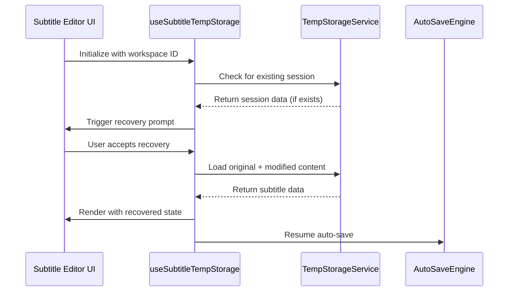
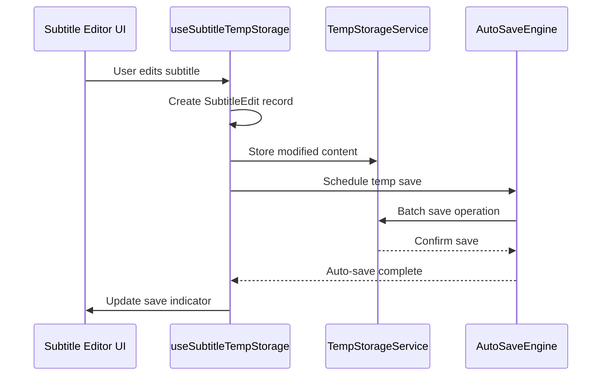
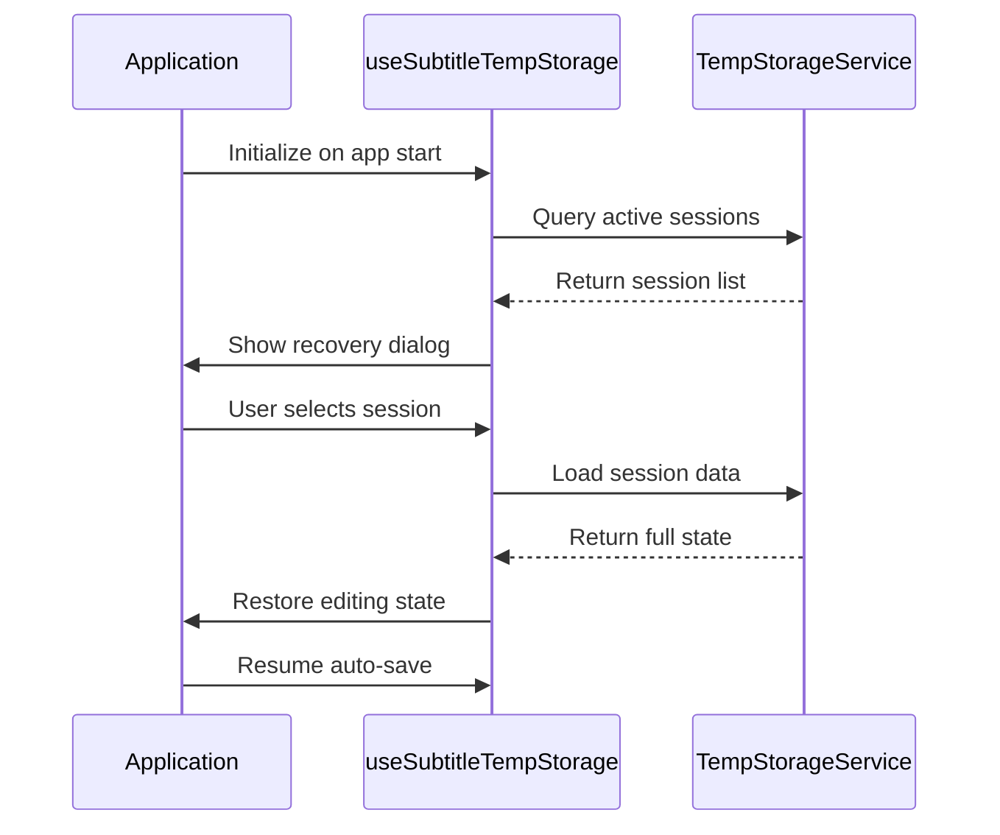

# Enhanced Subtitle Auto-Save System Design

## Executive Summary

This document outlines the design for an enhanced auto-save system for Step 4 subtitle editing in the Canton-Cap Electron application. The system provides dual temporary storage for original and modified subtitle JSON files, ensuring persistence across application reloads while building upon the existing auto-save infrastructure.

## 1. Current System Analysis

### Existing Components
- **useSubtitlePersistence Hook**: Comprehensive file operations with caching and validation
- **AutoSaveEngine**: Intelligent batching and performance monitoring
- **SubtitlePersistenceService**: IPC communication with backend storage
- **WorkspaceDatabase**: IndexedDB-based storage system
- **EnhancedSubtitleFileCache**: Compression and predictive loading

### Current Limitations
- No distinction between original (model-generated) and modified (user-edited) content
- Limited session recovery across app reloads
- No specialized temp storage for active editing sessions
- Lack of granular versioning for subtitle edits

## 2. Enhanced Architecture Design

### 2.1 Storage Architecture

```typescript
interface SubtitleTempStorage {
  // Original JSON (immutable baseline)
  original: {
    fileId: string
    content: SubtitleFileContent
    source: 'model-generated' | 'json-import'
    timestamp: number
    hash: string // For integrity verification
    metadata: {
      workspaceId: string
      sessionId: string
      importSource?: string
      modelVersion?: string
    }
  }
  
  // Modified JSON (user edits)
  modified: {
    fileId: string
    content: SubtitleFileContent
    baseHash: string // References original.hash
    editHistory: SubtitleEdit[]
    lastModified: number
    autoSaveCount: number
    unsavedChanges: boolean
    metadata: {
      editSession: string
      totalEdits: number
      lastAutoSave: number
    }
  }
  
  // Session metadata
  session: {
    sessionId: string
    workspaceId: string
    startTime: number
    lastActivity: number
    status: 'active' | 'paused' | 'completed'
    recoveryData?: {
      step: number
      position: number
      selectedSubtitleIds: string[]
    }
  }
}
```

### 2.2 Edit Tracking System

```typescript
interface SubtitleEdit {
  id: string
  timestamp: number
  type: 'text-change' | 'timing-change' | 'speaker-change' | 'addition' | 'deletion'
  subtitleId: string
  before: Partial<SubtitleEntry>
  after: Partial<SubtitleEntry>
  confidence?: number
  userInitiated: boolean
}

interface SubtitleEntry {
  id: string
  startTime: number
  endTime: number
  text: string
  translation?: string
  confidence?: number
  speaker?: string
  isMusic: boolean
}
```

### 2.3 Storage Layer Architecture

```
┌─────────────────────────────────────────────────────────────┐
│                    Subtitle Editing UI                     │
├─────────────────────────────────────────────────────────────┤
│                useSubtitleTempStorage Hook                  │
├─────────────────────────────────────────────────────────────┤
│              Enhanced Auto-Save Engine                      │
├─────────────────────────────────────────────────────────────┤
│   ┌─────────────────┐  ┌─────────────────┐  ┌──────────────┐ │
│   │   Temp Store    │  │  Session Store  │  │ Cache Layer  │ │
│   │   (IndexedDB)   │  │   (IndexedDB)   │  │  (Memory)    │ │
│   └─────────────────┘  └─────────────────┘  └──────────────┘ │
├─────────────────────────────────────────────────────────────┤
│              Subtitle Persistence Service                  │
├─────────────────────────────────────────────────────────────┤
│                    IPC Bridge                              │
├─────────────────────────────────────────────────────────────┤
│               Electron Main Process                        │
└─────────────────────────────────────────────────────────────┘
```

## 3. Implementation Strategy

### 3.1 Enhanced Storage Service

```typescript
class SubtitleTempStorageService {
  private tempDb: IDBDatabase
  private sessionDb: IDBDatabase
  
  // Original JSON management
  async storeOriginal(content: SubtitleFileContent, source: 'model-generated' | 'json-import'): Promise<string>
  async getOriginal(fileId: string): Promise<SubtitleFileContent | null>
  
  // Modified JSON management  
  async storeModified(fileId: string, content: SubtitleFileContent, editHistory: SubtitleEdit[]): Promise<void>
  async getModified(fileId: string): Promise<SubtitleFileContent | null>
  async appendEdit(fileId: string, edit: SubtitleEdit): Promise<void>
  
  // Session management
  async createEditSession(workspaceId: string): Promise<string>
  async updateSession(sessionId: string, recoveryData: any): Promise<void>
  async getSessionRecoveryData(sessionId: string): Promise<any>
  
  // Cleanup and maintenance
  async cleanupExpiredSessions(maxAge: number): Promise<void>
  async compactEditHistory(fileId: string): Promise<void>
}
```

### 3.2 Enhanced React Hook

```typescript
interface UseSubtitleTempStorageOptions {
  workspaceId: string
  autoSaveInterval?: number
  maxEditHistory?: number
  enableSessionRecovery?: boolean
  onRecoveryAvailable?: (sessionData: any) => void
}

interface UseSubtitleTempStorageResult {
  // Content state
  originalContent: SubtitleFileContent | null
  modifiedContent: SubtitleFileContent | null
  editHistory: SubtitleEdit[]
  hasUnsavedChanges: boolean
  
  // Session state
  sessionId: string | null
  isRecovering: boolean
  recoveryData: any
  
  // Operations
  initializeFromOriginal: (content: SubtitleFileContent, source: 'model-generated' | 'json-import') => Promise<void>
  updateSubtitle: (subtitleId: string, changes: Partial<SubtitleEntry>) => Promise<void>
  revertToOriginal: () => Promise<void>
  revertEdit: (editId: string) => Promise<void>
  
  // Session management
  saveSession: () => Promise<void>
  recoverSession: (sessionId: string) => Promise<void>
  clearSession: () => Promise<void>
  
  // Auto-save control
  enableAutoSave: () => void
  disableAutoSave: () => void
  forceAutoSave: () => Promise<void>
}

function useSubtitleTempStorage(options: UseSubtitleTempStorageOptions): UseSubtitleTempStorageResult
```

### 3.3 Integration with Existing Auto-Save Engine

```typescript
// Extend existing AutoSaveEngine
class EnhancedAutoSaveEngine extends AutoSaveEngine {
  // New operation types for temp storage
  scheduleOriginalSave(workspaceId: string, content: SubtitleFileContent, source: string): Promise<void>
  scheduleModifiedSave(workspaceId: string, fileId: string, content: SubtitleFileContent, editHistory: SubtitleEdit[]): Promise<void>
  scheduleSessionSave(sessionId: string, recoveryData: any): Promise<void>
  
  // Enhanced batch processing for subtitle edits
  private async processSubtitleEditBatch(operations: SaveOperation[]): Promise<void>
  
  // Session recovery management
  detectRecoverableSessions(workspaceId: string): Promise<string[]>
  cleanupExpiredTempData(maxAge: number): Promise<void>
}
```

## 4. User Experience Flow

### 4.1 Initial Load Scenario



### 4.2 Edit and Auto-Save Flow



### 4.3 App Reload Recovery



## 5. Technical Specifications

### 5.1 IndexedDB Schema

```typescript
// TempStorage Database
interface TempStorageSchema {
  originalSubtitles: {
    key: string // fileId
    value: {
      fileId: string
      content: SubtitleFileContent
      source: 'model-generated' | 'json-import'
      timestamp: number
      hash: string
      metadata: object
    }
    indexes: {
      workspaceId: string
      timestamp: number
      source: string
    }
  }
  
  modifiedSubtitles: {
    key: string // fileId
    value: {
      fileId: string
      content: SubtitleFileContent
      baseHash: string
      editHistory: SubtitleEdit[]
      lastModified: number
      autoSaveCount: number
      unsavedChanges: boolean
      metadata: object
    }
    indexes: {
      workspaceId: string
      lastModified: number
      baseHash: string
    }
  }
  
  editSessions: {
    key: string // sessionId
    value: {
      sessionId: string
      workspaceId: string
      originalFileId: string
      modifiedFileId: string
      startTime: number
      lastActivity: number
      status: 'active' | 'paused' | 'completed'
      recoveryData: object
    }
    indexes: {
      workspaceId: string
      lastActivity: number
      status: string
    }
  }
}
```

### 5.2 Performance Requirements

- **Initial Load**: < 200ms for session detection
- **Edit Response**: < 50ms for subtitle modifications
- **Auto-Save Latency**: < 100ms for temp storage writes
- **Recovery Time**: < 500ms for full session restoration
- **Memory Usage**: < 50MB for active editing session
- **Storage Efficiency**: 80% compression ratio for large subtitle files

### 5.3 Data Integrity

- **Hash Verification**: SHA-256 hashing for original content integrity
- **Edit Chain Validation**: Ensure edit history forms valid chain
- **Session Consistency**: Atomic updates for session state
- **Backup Strategy**: Periodic snapshots to persistent storage
- **Corruption Recovery**: Graceful fallback to last known good state

## 6. Migration Strategy

### 6.1 Backwards Compatibility

- Existing subtitle files remain unchanged
- Legacy auto-save continues to work
- Gradual migration of existing sessions
- Fallback to original system if temp storage fails

### 6.2 Migration Steps

1. **Phase 1**: Deploy new storage service alongside existing system
2. **Phase 2**: Update useSubtitlePersistence to use temp storage for new sessions
3. **Phase 3**: Migrate existing active sessions to new format
4. **Phase 4**: Remove legacy temporary storage code
5. **Phase 5**: Optimize and monitor performance

## 7. Testing Strategy

### 7.1 Unit Tests
- SubtitleTempStorageService operations
- Edit history management
- Session recovery logic
- Hash verification and integrity checks

### 7.2 Integration Tests
- React hook integration
- Auto-save engine coordination
- IndexedDB storage operations
- IPC communication

### 7.3 End-to-End Tests
- Complete edit session flow
- App reload recovery scenarios
- Multiple workspace handling
- Performance benchmarks
- Data integrity validation

## 8. Monitoring and Metrics

### 8.1 Performance Metrics
- Edit response times
- Auto-save success rates
- Session recovery success rates
- Storage operation latencies
- Memory usage patterns

### 8.2 User Experience Metrics
- Session recovery acceptance rates
- Edit frequency patterns
- Auto-save interruption incidents
- Data loss prevention effectiveness

## 9. Risk Mitigation

### 9.1 Data Loss Prevention
- Redundant storage with checksums
- Incremental backup strategy
- Session recovery validation
- Graceful degradation paths

### 9.2 Performance Safeguards
- Storage quota management
- Edit history size limits
- Background cleanup processes
- Memory usage monitoring

### 9.3 Error Handling
- Comprehensive error logging
- User-friendly error messages
- Automatic retry mechanisms
- Fallback to persistent storage

## 10. Future Enhancements

- Real-time collaboration support
- Cloud synchronization
- Advanced diff visualization
- Automated conflict resolution
- Machine learning-based edit suggestions

---

**Document Version**: 1.0  
**Last Updated**: 2025-01-31  
**Review Status**: Pending Implementation Team Review